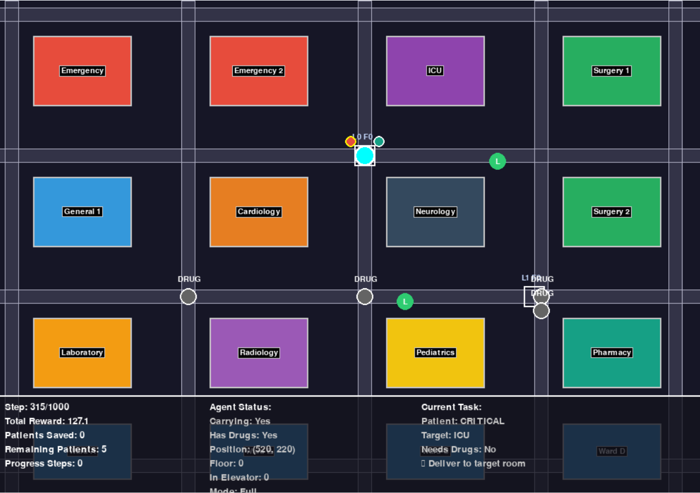

# Hospital Navigation RL Environment with Multi-Floor Elevator Support

A reinforcement learning environment for training AI agents to navigate a 3-floor hospital with elevator systems, collect patients, and deliver them to appropriate medical departments while managing medication delivery in a telemedicine platform context.

## 🏥 Environment Overview




This environment simulates a realistic 3-floor hospital layout where an AI agent must:

- **Navigate through hospital corridors** (cannot enter rooms directly)
- **Use elevators to travel between floors** (2 elevator shafts with queue-based FSM)
- **Collect patients** from corridor locations with different urgency levels
- **Obtain medications** from pharmacy drug stations when patients need them
- **Deliver patients** to appropriate medical departments on any floor
- **Maximize patient care efficiency** while minimizing time and resources

### Key Features

- **Multi-Floor Hospital**: 3 floors with 16 rooms per floor (48 total rooms)
- **Elevator System**: 2 independent elevators with realistic state machine (idle/moving/doors_open)
- **Floor-Aware Navigation**: Patients spawn on different floors; agent must navigate vertically
- **Realistic Hospital Layout**: Multiple departments including Emergency, ICU, Surgery, Cardiology, Neurology, Pediatrics, Lab, Radiology, and Pharmacy
- **Corridor-Only Navigation**: Agent must stick to realistic pathways between rooms
- **Multi-Objective Task**: Balance between patient collection, drug delivery, elevator usage, and room assignment
- **Dynamic Patient Spawning**: Patients appear with varying urgency and medication needs on different floors
- **Visual Feedback**: Pygame-based rendering with floor indicators and elevator status display

## 🎯 Mission Context

This environment supports the development of AI systems for telemedicine platforms and digital AI labs by:

1. **Route Optimization**: Training agents to find efficient paths in complex healthcare facilities
2. **Resource Management**: Learning to prioritize tasks based on patient urgency and medication needs
3. **Decision Making**: Balancing multiple objectives in time-critical healthcare scenarios
4. **Workflow Automation**: Optimizing patient flow and medication delivery processes

## 📁 Project Structure

```
hospital-navigation-rl/
├── hospital_env.py          # Main environment implementation (multi-floor + elevators)
├── dqn_agent.py            # Deep Q-Network agent
├── ppo_agent.py            # Proximal Policy Optimization agent
├── a2c_agent.py            # Advantage Actor-Critic agent
├── reinforce_agent.py      # REINFORCE algorithm agent
├── train.py                # Training script for all algorithms
├── play.py                 # Demo script with keyboard control and model loading
├── requirements.txt        # Python dependencies
├── README.md              # This file
├── ELEVATOR_CHANGES.md    # Documentation of elevator feature changes
├── models/                # Saved model directory
├── results/              # Training results and plots
└── demos/               # Generated demonstration GIFs
```

## 🚀 Quick Start

### Installation

1. Clone the repository:
```bash
git clone <repository-url>
cd hospital-navigation-rl
```

2. Install dependencies:
```bash
pip install -r requirements.txt
```

### Running Demonstrations

View the environment with keyboard control (recommended):
```bash
python play.py --mode keyboard
```

**Keyboard Controls:**
- Arrow keys: Move in 4 directions
- Q/E/Z/C: Diagonal movement
- SPACE: Stay still
- **L**: Call elevator
- **O**: Board elevator
- **P**: Exit elevator
- **W**: Go up one floor (inside elevator)
- **S**: Go down one floor (inside elevator)
- R: Reset environment

View the environment with a random agent:
```bash
python play.py --mode random --episodes 3
```

View strategic random agent:
```bash
python play.py --mode strategic --episodes 3
```

Show static hospital layout:
```bash
python play.py --mode layout
```

Test trained model:
```bash
python play.py --mode trained --model models/dqn_hospital_navigation.zip --episodes 3
```

### Training Agents

Train all algorithms and compare (recommended):
```bash
python train.py --algorithm all --episodes 1000
```
**Training time:** ~1.3 hours (CPU) or ~15-20 minutes (GPU)

Train specific algorithm:
```bash
python train.py --algorithm dqn --timesteps 150000    # ~5 min
python train.py --algorithm ppo --timesteps 300000    # ~6 min
python train.py --algorithm reinforce --episodes 1000 # ~58 min
python train.py --algorithm a2c --timesteps 150000    # ~3 min
```

Evaluate trained model:
```bash
python train.py --algorithm dqn --evaluate
```

## 🤖 Reinforcement Learning Algorithms

This project implements four RL algorithms optimized for the multi-floor hospital environment:

### 1. Deep Q-Network (DQN) - Value-Based Method

**Characteristics:**
- **Type**: Off-policy, value-based
- **Action Selection**: Epsilon-greedy with experience replay
- **Network**: Deep neural network (256→256→128→64) approximating Q-values
- **Training**: Uses target network and experience replay buffer

**Advantages:**
- Sample efficient through experience replay
- Stable learning with target network
- Works well in discrete action spaces (14 actions)

**Implementation Features:**
- Experience replay buffer (100,000 transitions)
- Target network updated every 2,000 steps
- Epsilon decay from 1.0 to 0.1 over 60% of training
- Gradient clipping for stability
- Higher discount factor (γ=0.995) for long-term planning

### 2. Proximal Policy Optimization (PPO) - Policy-Based Method

**Characteristics:**
- **Type**: On-policy, actor-critic
- **Action Selection**: Stochastic policy with probability sampling
- **Network**: Shared network with actor and critic heads
- **Training**: Uses clipped surrogate objective

**Advantages:**
- More stable than vanilla policy gradient
- Good sample efficiency
- Handles multi-floor navigation well

**Implementation Features:**
- Generalized Advantage Estimation (GAE)
- Clipped surrogate objective (ε = 0.2)
- Multiple epochs per update (4 epochs)
- Entropy regularization for exploration

### 3. A2C (Advantage Actor-Critic) - Actor-Critic Method

**Characteristics:**
- **Type**: On-policy, actor-critic
- **Action Selection**: Stochastic policy
- **Network**: Shared actor-critic architecture
- **Training**: Advantage function for policy updates

**Advantages:**
- Faster than PPO with synchronous updates
- Lower variance than REINFORCE
- Good for real-time learning

**Implementation Features:**
- Synchronous gradient updates
- Advantage estimation for reduced variance
- Fast training on multi-floor problems

### 4. REINFORCE - Policy Gradient Method

**Characteristics:**
- **Type**: On-policy, policy gradient
- **Action Selection**: Direct policy optimization
- **Network**: Policy network outputting action probabilities
- **Training**: Monte Carlo policy gradient

**Advantages:**
- Simple and intuitive
- Direct policy optimization
- Works with stochastic policies

**Implementation Features:**
- Monte Carlo returns calculation
- Baseline subtraction (return normalization)
- Gradient clipping for stability
- Episode-based updates

## 🎮 Environment Details

### State Space (Observation)
The observation vector contains **46 dimensions**:
- **Agent Position**: Normalized x, y coordinates (2 values)
- **Agent Status**: Carrying patient flag, has drugs flag (2 values)
- **Agent Floor**: Current floor (0-2) (1 value)
- **In Elevator**: Elevator index or -1 if not in elevator (1 value)
- **Patient Information**: Up to 6 patients with position, urgency, drug needs, floor (30 values)
- **Drug Station Status**: Availability per floor (4 values)
- **Distance Information**: Nearest patient, drug, room, elevator (4 values)
- **Elevator State**: Nearest elevator floor and state (2 values)

**Total Observation Size**: 46 dimensions

### Action Space
**14 discrete actions** representing movement and elevator control:
- **0-3**: Cardinal directions (Up, Down, Left, Right)
- **4-7**: Diagonal movement (Up-Left, Up-Right, Down-Left, Down-Right)
- **8**: Stay still
- **9**: Call elevator (press call button)
- **10**: Board elevator (enter elevator when doors open)
- **11**: Exit elevator (leave elevator when doors open)
- **12**: Floor Up (move elevator up one floor)
- **13**: Floor Down (move elevator down one floor)

### Elevator Mechanics

**Elevator States:**
- `idle`: Waiting at a floor
- `moving`: Traveling between floors (~5 steps per floor)
- `doors_open`: Doors open for boarding/exiting

**Usage Flow:**
1. Call elevator (action 9) → elevator added to queue
2. Wait for elevator to arrive (state changes to `doors_open`)
3. Board elevator (action 10) → agent enters elevator
4. Press floor button (actions 12/13) → elevator moves
5. Wait ~5 steps for travel
6. Exit elevator (action 11) → agent leaves at new floor

### Reward Structure

**Positive Rewards:**
- +20: Successful vertical transit (completed floor change)
- +20: Collecting drugs from pharmacy
- +40: Delivering drugs to patient needing medication
- +50-100: Delivering patient to correct department (based on urgency)
- +0.02: Staying in corridor (encourages valid navigation)

**Negative Rewards:**
- -0.1: Each step (efficiency incentive)
- -0.05: Waiting for elevator (small penalty)
- -5: Delivering patient to wrong department

**Special Mechanics:**
- Patients spawn on random floors with target floors
- Drug stations available per floor
- Agent floor tracked independently
- Delivery only succeeds if agent and room are on same floor

### Episode Termination
Episodes end when:
- Maximum steps reached (1000 steps)
- All patients have been saved
- User closes the window (in demo mode)

## 📊 Performance Metrics

The training system tracks:
- **Episode Rewards**: Total reward accumulated per episode
- **Patients Saved**: Number of patients successfully delivered
- **Floors Traversed**: Vertical navigation success rate
- **Elevator Usage**: Efficiency of elevator calls and usage
- **Training Loss**: Algorithm-specific loss functions
- **Evaluation Performance**: Periodic deterministic testing

### Expected Training Times

| Setup | Time (1000 episodes) | Notes |
|-------|---------------------|-------|
| **CPU (modern 8-core)** | ~1.3 hours | Default setup |
| **CPU (older 4-core)** | ~2-3 hours | Slower but works |
| **GPU (CUDA)** | ~15-20 minutes | 5-10x speedup |
| **Single algorithm (DQN)** | ~5 minutes | Quick testing |

## 🔧 Customization

### Environment Parameters
Modify `hospital_env.py` to adjust:
- Number of floors (`NUM_FLOORS = 3`)
- Elevator positions and count (`ELEVATOR_POSITIONS`)
- Elevator travel time (`ELEVATOR_TRAVEL_TIME = 5`)
- Hospital layout and room positions
- Number and placement of drug stations
- Patient spawn rates and characteristics
- Reward values for different actions
- Maximum episode length

### Agent Hyperparameters
Each agent file contains configurable hyperparameters:
- Learning rates (default: 3e-4 for DQN)
- Network architectures (default: [256, 256, 128, 64])
- Exploration parameters (epsilon decay, entropy)
- Training frequencies
- Buffer sizes (DQN: 100k, larger for complex environments)

### GPU Acceleration
All agents automatically use GPU if available:
```python
# Check GPU availability
import torch
print(torch.cuda.is_available())
```

To force CPU:
```bash
python train.py --algorithm dqn --device cpu
```

## 📈 Expected Results

### Performance Comparison

**DQN**:
- Expected to show steady improvement through experience replay
- Good final performance but may take longer to converge
- Stable learning curve with target network stabilization
- Best for: Sample efficiency with replay buffer

**PPO**:
- Generally fastest and most stable convergence
- Best balance of exploration and exploitation
- Highest final performance expected
- Best for: Overall performance and stability

**A2C**:
- Fast training with synchronous updates
- Good convergence speed
- Lower memory usage than DQN
- Best for: Quick iterations and real-time learning

**REINFORCE**:
- More variable learning curve
- May require more episodes to converge
- Simpler but potentially less efficient
- Best for: Understanding policy gradients

### Typical Training Progress
- **Episodes 0-200**: Random exploration, learning floor navigation
- **Episodes 200-500**: Learning basic elevator usage and patient collection
- **Episodes 500-800**: Optimizing multi-floor drug delivery and room assignments
- **Episodes 800-1000**: Fine-tuning efficiency and elevator scheduling

### Multi-Floor Challenges
Agents must learn:
1. **Spatial awareness across floors** (46-dim observation space)
2. **Elevator timing** (5-step travel time per floor)
3. **Floor-aware patient matching** (patients on different floors)
4. **Vertical transit optimization** (minimize unnecessary floor changes)

## 🐛 Troubleshooting

### Common Issues

1. **Pygame Installation Issues**:
```bash
pip install pygame --upgrade
```

2. **CUDA/GPU Issues**:
```bash
# Check GPU availability
python -c "import torch; print(torch.cuda.is_available())"

# Force CPU usage if GPU issues
set CUDA_VISIBLE_DEVICES=
```

3. **Memory Issues with Large Replay Buffers**:
Reduce buffer size in `dqn_agent.py`:
```python
'buffer_size': 50000  # Reduced from 100000
```

4. **Slow Training**:
- Reduce episode length: `max_steps=500`
- Use fewer training timesteps initially
- Disable rendering during training
- Use GPU if available (5-10x speedup)

5. **Agent Not Learning Multi-Floor Navigation**:
- Increase exploration: `exploration_final_eps=0.15`
- Increase training time: `--timesteps 300000`
- Check elevator reward shaping in environment

6. **Old Models Won't Load**:
Models trained with old action space (9 or 13 actions) are incompatible with new 14-action space. Retrain required.

7. **Unicode/Emoji Errors in Terminal**:
All emoji print statements removed. If issues persist:
```bash
# Use UTF-8 encoding
set PYTHONIOENCODING=utf-8
```

## 📚 References

- [Deep Q-Learning Paper](https://arxiv.org/abs/1312.5602)
- [PPO Paper](https://arxiv.org/abs/1707.06347)
- [A2C Paper](https://arxiv.org/abs/1602.01783)
- [REINFORCE Algorithm](https://papers.nips.cc/paper/1713-policy-gradient-methods-for-reinforcement-learning-with-function-approximation.pdf)
- [Gymnasium Documentation](https://gymnasium.farama.org/)
- [Stable Baselines3](https://stable-baselines3.readthedocs.io/)

## 🎯 Key Achievements

- ✅ **Multi-floor navigation** with 3-floor hospital layout
- ✅ **Elevator system** with realistic FSM (idle/moving/doors_open)
- ✅ **14-action space** including elevator controls
- ✅ **46-dimensional observation** with floor and elevator state
- ✅ **Four RL algorithms** (DQN, PPO, A2C, REINFORCE) optimized for multi-floor
- ✅ **Keyboard control mode** for manual testing and demonstration
- ✅ **GPU acceleration** with automatic fallback to CPU
- ✅ **Comprehensive training comparison** with metrics and plots

## 🤝 Contributing

1. Fork the repository
2. Create a feature branch
3. Make your changes
4. Add tests if applicable
5. Submit a pull request

## 📄 License

This project is licensed under the MIT License - see the LICENSE file for details.

## 🙏 Acknowledgments

- Built using Gymnasium framework
- Pygame for visualization
- PyTorch for deep learning implementations
- Inspired by healthcare workflow optimization research